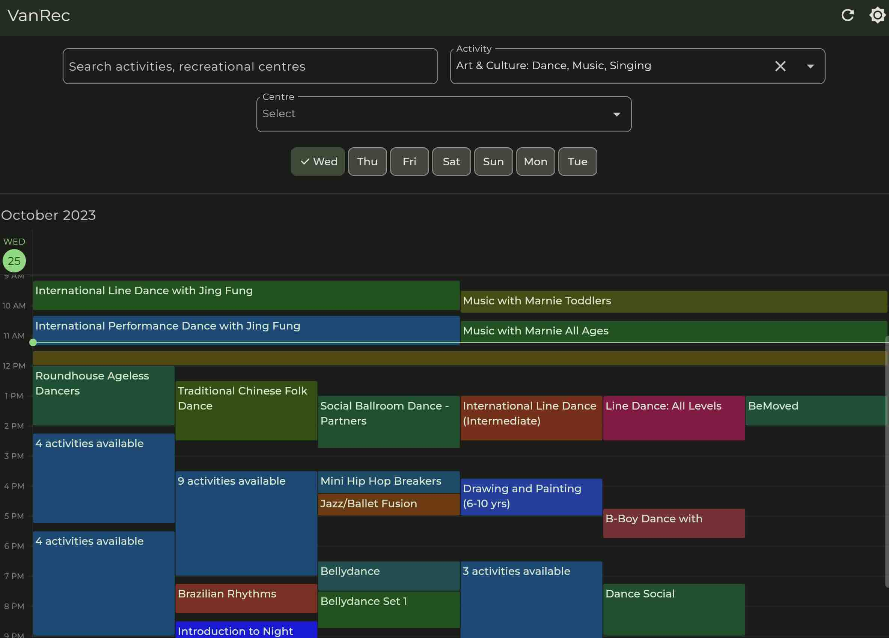
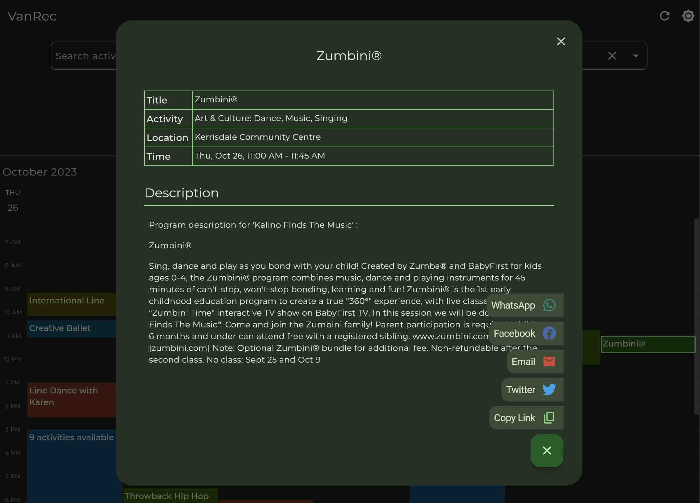
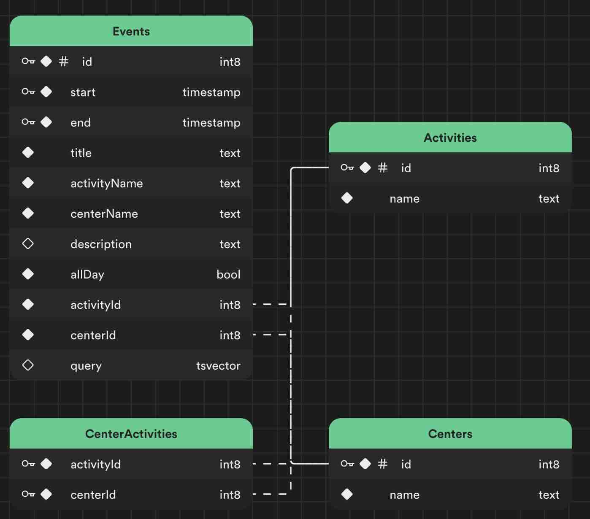

# VanRec

VanRec, short for Vancouver Recreational Centers is an open source cross-platform app aimed at providing
users with access to an extensive catalog of Vancouver Park Board facilities within 
their local area. Whether you're interested in exploring indoor pools, outdoor golf 
courses, fitness centers, or skateboard parks, this app offers a resource for 
discovering these recreational amenities in your community.


<br><br>


## Getting Started
This project uses Supabase for storage. To get started. Go to https://supabase.com and create a project.
Get connection url and key, and put them inside `.env` file in the root folder of this project. 

Example `.env` file
```
SUPABASE_URL=https://lkajsdlkjasda.supabase.co
SUPABASE_KEY=asdasd.asdasd.asdasdasdasd
```

## Database Schema
The project expects you have a database with the following schema.


## Google analytics
- To enable google analytics run the following command.
```
flutterfire configure
```

- If you don't need it, you can safely remove below line from `main.dart`
```dart
await Firebase.initializeApp(options: DefaultFirebaseOptions.currentPlatform);
```

## Populate Database

- Scrape and import Activities
```shell
dart importer/bin/importer.dart a
```

- Scrape and import Centres
```shell
dart importer/bin/importer.dart c
```

- Scrape and import Events
```shell
dart importer/bin/importer.dart e
```

## Run Project
Once you have some data in the database you can run the project.
```
flutter run -d chrome
```